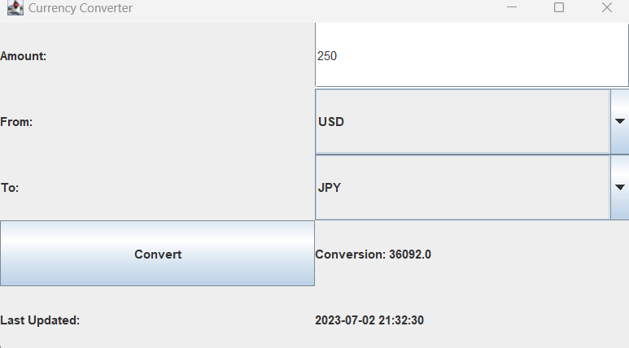

# CurrencyX :currency_exchange::heavy_dollar_sign:
<h2>Introduction</h2>

CurrencyX is a window-based application that centers around currency exchange rates and leverages Java Swing components to create its graphical user interface (GUI). The use of Java Swing allows for the inclusion of various interactive elements, such as buttons, labels, text fields, and tables, which enhance the user experience. Additionally, the application retrieves live exchange rates from ExchangeRate-API.

Overall, CurrencyX serves as a fundamental application that showcases the implementation of Java and Java Swing in currency conversion. By providing users with a tool to efficiently convert currencies, CurrencyX addresses a common need in a straightforward manner.

<h2>Installation</h2>

The following dependencies and applications will need to be installed:

<ol>
<li> IntelliJ or Eclipse: Download your IDE if you don't have it on your computer. </li>
<li> Import the following packages: AWT, awt.event, Swing, swing.event, Gson library (an alternative to Json Parser/JSON dependencies) </li>
<li> Create a free, API key (www.exchangerate-api.com) to fetch live exchange rates</li>
<li> Also, make sure to include all dependencies in your pom.xml file.</li>
</ol>

<h2>Technologies Used</h2>
<ul>
<li>IntelliJ (IDE)</li>
<li>Postman (API Testing)</li>
<li>Spring Boot (Framework)</li>
<li>Java (Programming Language)</li>
<li>Maven (Dependency Management)</li>
</ul>

<h2>Application Features of CurrencyX & The GUI</h2>
<ol>
<li><b>User-Friendly Window-Based Application:</b> CurrencyX offers a user-friendly interface built using Java Swing components</li>
<li><b>Easy Amount Input:</b>  Users can conveniently enter the amount they want to convert into the designated input field.</li>
<li><b>Instant Conversion:</b>  By clicking the "Convert" button, users can obtain instant and accurate currency conversion results based on the selected currencies and entered amount. </li>
<li><b>Live Exchange Rates:</b>  CurrencyX utilizes reliable live exchange rates from ExchangeRate-API, ensuring up-to-date conversion calculations.</li>
<li><b>Swap Functionality:</b> CurrencyX includes a "Swap" button that allows users to effortlessly switch between the selected base and target currencies. This feature saves time and eliminates the need for manual adjustments when switching conversion directions.</li>
<li><b>Supported Currencies:</b> CurrencyX supports a range of widely used currencies, including <b>USD, EUR, MXN, JPY, CHF, and GBP.</b> Users can perform conversions between these currencies seamlessly within the application.</li>
</ol>  

<h2>Resources & Documentation Used⛑️</h2>
<ul>
<li>Setup Free API Key: <a href="www.exchangerate-api.com">Exchange Rate API</a></li>
<li>Exchange Rate API Documentation: <a href="https://www.exchangerate-api.com/docs/overview">Exchange Rate API</a></li>
<li>Create Platform-Independent Components in Java: <a href="https://www.javatpoint.com/java-swing">Java Swing Tutorial</a></li>
<li>Get A List of Current Exchange Rates: <a href="https://www.oanda.com/currency-converter/en/?from=EUR&to=USD&amount=1">Oanda</a></li>
<li>How to Use GridBagLayout: <a href="https://docs.oracle.com/javase/tutorial/uiswing/layout/gridbag.html">Java Documentation</a></li>
<li>Java Simple-Date Format: <a href="https://docs.oracle.com/javase/8/docs/api/java/text/SimpleDateFormat.html">Java Documentation</a></li>
<li>How To Use Java HttpURLConnection for HTTP GET and POST Requests: <a href="https://www.digitalocean.com/community/tutorials/java-httpurlconnection-example-java-http-request-get-post">DigitalOcean Tutorial</a></li>
<li>Extending the JFrame Class: <a href="https://chortle.ccsu.edu/java5/notes/chap56/ch56_11.html">Java - Central Connecticut State University</a></li>
</ul>
